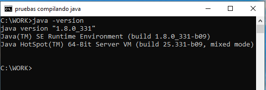

# Compilar con java

## Intro
Vamos a ver las herramientas para compilar y empaquetar archivos de java que provee el JDK, y como funciona el classpath.
Vamos aprender a compilar nuestras aplicaciones en Java desde la consola de manera básica sin necesidad de usar ningún IDE ni ningún gestor de librerías, cuando nuestro desarrollo va ganado en complejidad este metodo se vuelve impracticable, sin embarjo es un buen ejercicio para conocer el funcionamiento de las herramientas de dessarrollo de Java a bajo nivel.

Básicamente el Java Runtime Environment (en adelante JRE) es la máquina virtual de java (JVM) más ciertas librerías necesarias para ejecutar las aplicaciones de Java.    
Por otro lado el Java Development Kit (JDK) esta pensado para el desarrollo de aplicaciones, por lo que trae el JRE para ejecutar las aplicaciones más una serie de herramientas necesarias para el desarrollo como pueden ser los compiladores, debuggear empaquetadores etc.


## Requisitos
Aunque actualmente ya estamos por la versión 18 de Java, vamos a usar el JDK 8 que a nivel empresarial aún se sigue usando ya que Oracle mantiene una licencia menos restrictiva. 
Para ello, podemos descargar el [JDK de Oracle](https://www.oracle.com/java/technologies/downloads/) o el [OpenJDK](https://openjdk.org/projects/jdk8/) y añadirlo al path en Windows, para ello puedes encontrar muchos tutoriales en internet como por ejemplo [este](https://www.aprenderaprogramar.com/index.php?option=com_content&view=article&id=389:configurar-java-en-windows-variables-de-entorno-javahome-y-path-cu00610b&catid=68&Itemid=188)


Comprobamos que tenemos instalado el JDK en Windows. Para ello, buscando "cmd" o "Símbolo del sistema" en el buscador de Windows para abrir la consola y ejecutamos ``java -version`` para saber que el path del sistema apunta a la instalación de Java.



También es conveniente comprobar el comando `jar` (Java Archive Tool) que sirve para empaquetar varios archivos java.
```
C:\Users\Ruben>jar
Sintaxis: jar {ctxui}[vfmn0PMe] [jar-file] [manifest-file] [entry-point] [-C dir] files ...
Opciones:
    -c  crear nuevo archivo
```
Se muestra la ayuda del comando, en caso de que no se encuentre la aplicación `jar` mostrará el siguiente error.
```
C:\Users\Ruben>jar
"jar" no se reconoce como un comando interno o externo,
programa o archivo por lotes ejecutable.
```
Si no se reconoce `jar` pero si `java -version` puede ser que tu variable de entorno apunte a un JRE en vez de al JDK. Puedes ver en el [diagrama de JDK 8](https://docs.oracle.com/javase/8/docs/) que el módulo "jar" pertenece a el JDK pero no a el JRE porque es una herramienta de desarrollo.

## 1 Compilar y descompilar una clase java

## 1.1 Compilar HolaMundo

Vamos a crear un archivo java que contenga una clase que imprima "Hola mundo", luego la vamos a compilar y ejecutar desde el set de herramientas de JDK. 

### Crear HolaMundo.java

Primero creamos un archivo llamado HolaMundo.java que contenga lo siguiente:
```
public class HolaMundo {
    public static void main(String[] args) {
        System.out.println("Hola Mundo");
    }  
}
```
Para ello podemos hacerlo gráficamente:
1. Podemos hacer click-derecho sobre el escritorio
2. ir a *Nuevo* -> *Documento de texto*
3. renombralo por *HolaMundo.java*
4. abrirlo con el blog de notas para editar el archivo java

Ya que vamos a usar la consola  para esta práctica, podemos crear el archivo desde el `cmd` así:


1. `more >> HolaMundo.java` para guardar lo que escribamos en el archivo
2. Pegamos el contenido
3. Hacemos Ctrl+C para cerrar y guardar

O desde la PowerShell sería de la siguiente manera:
```
$claseHolaMundo = @"
public class HolaMundo {
    public static void main(String[] args) {
        System.out.println("Hola Mundo");
    }  
}
"@
 Add-Content "HolaMundo.java" $claseHolaMundo
```


Nota: Podemos acceder al interprete de powershell desde la misma cmd  escribiendo comando el ``powershell``.

### Compilamos y ejecutamos HolaMundo

Compilamos el archivo "HolaMundo.java" con el comando `javac  HolaMundo.java` que nos genera el archivo compilado HolaMundo.class

Ahora ejecutamos la clase generada
```
java HolaMundo
> Hola Mundo

# no poner la extension
java HolaMundo.class
#Error: no se ha encontrado o cargado la clase principal 
```

Vemos que al ejecutar `java HolaMundo` se imprime la salida por consola, normalmente tenemos una clase principal que depende de otras clases por lo que no es una formas practica de ejecutarlo, ya que tendriamos que nombrar cada una de las classes para poderlo ejecutarlo. Necesitariamos empaquetar todos los compilados dentro de un mismo archivo jar.

```
jar cvf hola.jar HolaMundo.class
> manifiesto agregado
> agregando: HolaMundo.class(entrada = 422) (salida = 286)(desinfl
```
Ahora nos ha empaquetado la clase en el archivo hola.jar que podria contener todas las clases necesarias y se podria ejecutar.

#ejecutar paquete  (sin classpath en el manifest)
```
java hola.jar
> Error: no se ha encontrado o cargado la clase principal hola.jar

# El flag `-cp` se refiere a classpath
java -cp hola.jar HolaMundo
> Hola Mundo
```
Con esto ejecutamos nuestra aplicacion empaquetada. El comando `java hola.jar` se funcionaria si hubieramos definido la clase main en el manifest. La clase main le dice a java cual es la clase principal que tiene que ejecutar.

Una aplicación normal tiene decenas de clases que definimos en el classpath para que ha la hora de la compilacion pueda encontrar todas las librerias y herramientas. 

El comando del ejemplo, también puede ser escrito sin contraer `java -classpath hola.jar HolaMundo`. Por ejemplo, si se hiciera uso del jdbc para conectarmos a la base de datos de MariaDB, la añadiriamos al classpath `java -cp hola.jar;mariadb-java-client-3.0.8.jar HolaMundo` para que encuentra las clases en la compilación.


## 1.2 Descompilar clase del paquete hola.jar

Podemos listar el contenido del paquete `hola.jar` que hemos creado.
```
jar -tf hola.jar
> META-INF/
> META-INF/MANIFEST.MF
> HolaMundo.class
```

Vemos que aparte del fichero HolaMundo.class tenemos una carpeta META_INFO con el MANIFEST.MF donde se define aspectos del JAR como la clase principal, el nombre de aplicación, autor, número de version etc. 

```
#-p es para imprimir por pantalla en vez de generar un archivo
unzip -p hola.jar META-INF/MANIFEST.MF
> Manifest-Version: 1.0
> Created-By: 1.8.0_331 (Oracle Corporation)
```
Vemos el contenido del manifest y solo tiene información por defecto. 

Podemos añadir más información como se muestra a continuación
```
Manifest-Version: 1.0
Built-By: blogruben
Created-By: ruben
Implementation-Title: HolaMundo
Implementation-Version: 01.00.00
Implementation-Build: 00000000-0000
Main-Class: com.example.MainClass
Class-Path: lib/lib1.jar lib/lib2.jar
```

Aquí destacaría, los propiedades de Main-Class y el Class-Path si en nuestro ejemplo anterior añadimos `Main-Class: HolaMundo` y `Class-Path: mariadb-java-client-3.0.8.jar` solo tendríamos que ejecutar `java hola.jar` y cogeria el classpath y el main class definidos en el manifest.
```
#extraer todo en un directorio
unzip hola.jar -d Hola
#volvemos a compilar
jar cvf hola.jar -C Hola/ .
```
Podemos extraer un archivo jar usando unzip
ya que es realidad es un comprimido como un zip

```
#extraer todo
jar -xf hola.jar 
#extraer un archivo en concreto
jar -xf hola.jar HolaMundo.class
```
Con la herramienta `jar` que provee el JDK, podemos extraer 
todos los archivos o seleccionar algunos en concreto

Descargar Java Decompiler Proyect
y ver el contenido del binario HolaMundo.class
http://java-decompiler.github.io/

## 1.3 Definir clase principal
```
#creamos el paquete diciendo que holaMundo es la clase principal
jar cvfe hola.jar HolaMundo HolaMundo.class

#ya podemos ejecutar sin espeificar el classpath
java -jar hola.jar
```
Podemos definir directamente la clase principal, cuando generamos el paquete jar, por lo que no tenemos que modificar el manifest mas tarde.


## 2 Modificar manifest y classpath
## 2.1 Crear libreria 
Vamos a hacer el ejemplo un poco mas realista, para ellos vamos a creamos un paquete para el main class.
para definirlo en el manifest

Creamos un fichero en la siguiente ruta: 
org/blogruben/prueba/tools/Impresion.java 
```
package org.blogruben.prueba.tools;

public class Impresion {
    public static void imprimir(String msg){
        System.out.println(msg);
    }
}
```
En el cmd `mkdir org\blogruben\prueba\tools` y `more >> org\blogruben\prueba\tools\Impresion.java`

Y generamos el paquete impresion.jar
```
#compilamos
javac org/blogruben/prueba/tools/Impresion.java

#empaquetamos
jar cvf impresion.jar org/blogruben/prueba/tools/Impresion.class
```


## 2.1 Compilar clases con sus paquetes

Tenemos el paquete de antes lib/impresion.jar que lo vamos a usar como libreria.
Ahora creamos dos clases, que hacen uso de impresion.jar

Creamos org/blogruben/prueba/HolaMundo.java
```
package org.blogruben.prueba;

import org.blogruben.prueba.tools.Impresion;

public class HolaMundo {
   public static void main(String[] args) {
    Impresion.imprimir("Hola mundo !!!!");
   }
}
```

Creamos org/blogruben/prueba/AdiosMundo.java
```
package org.blogruben.prueba;

import org.blogruben.prueba.tools.Impresion;

public class AdiosMundo {
   public static void main(String[] args) {
       Impresion.imprimir("Adios mundo cruel!");
   }
}
```

```
#compilamos
javac -d compilado -cp impresion.jar org/blogruben/prueba/HolaMundo.java org/blogruben/prueba/AdiosMundo.java

#empaquetamos 
jar cvfe saludos.jar org.blogruben.prueba.HolaMundo org/blogruben/prueba/HolaMundo.java org/blogruben/prueba/AdiosMundo.java

> added manifest
> adding: org/blogruben/prueba/HolaMundo.java(in = 205) (out= 144)(deflated 29%)
> adding: org/blogruben/prueba/AdiosMundo.java(in = 214) (out= 148)(deflated 30%)
```


## 2.2 Manifest con classpath
Creamos el manifest.txt
touch manifest.txt (en linux o mac)
type nul >> "manifest.txt" (en windows)
(si el mainClass no tiene paquete no funciona)
```
Manifest-Version: 1.0
Created-By: Blogruben
Main-Class: org.blogruben.prueba.HolaMundo
Class-Path: ./lib/impresion.jar
```


```
#comprobamos que tenemos los compilados
javac org/blogruben/prueba/HolaMundo.java org/blogruben/prueba/AdiosMundo.java

#comprobamos que tenemos la libreria del paso anterior  ./lib/impresion.jar

#creamos el paquete hola con el manifest de antes
jar cfm saludos.jar manifest.txt org/blogruben/prueba/HolaMundo.class org/blogruben/prueba/AdiosMundo.class 

#ejecutamos sin espeificar el classpath
java -jar saludos.jar
>Hola mundo !!!!
```

Si modificamos el manifest poniendo que el mainclass sea AdiosMundo, `Main-Class: org.blogruben.prueba.AdiosMundo` ejecutamos esta clase para despedirnos. 

```
#Actualizar manifest
jar uvfm saludos.jar manifest.txt

java -jar saludos.jar
>Adios mundo cruel!
```

Este post esta basado en la
[documentación oficial](https://docs.oracle.com/javase/tutorial/deployment/jar/build.html) de compilar y empaquetar los fuentes de Java.

