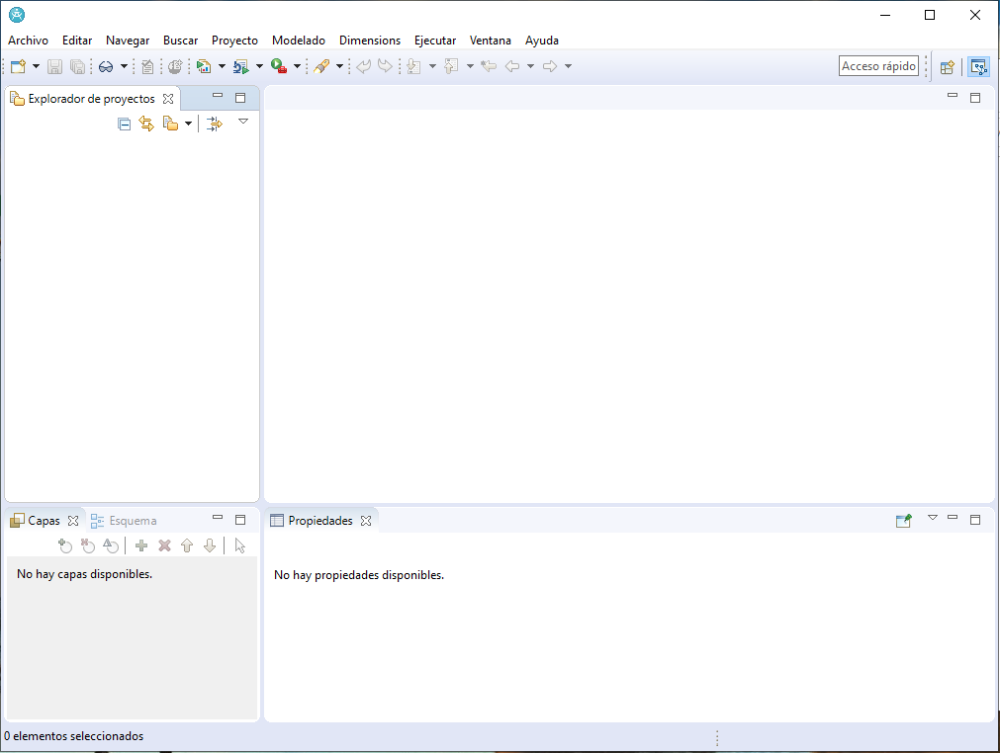
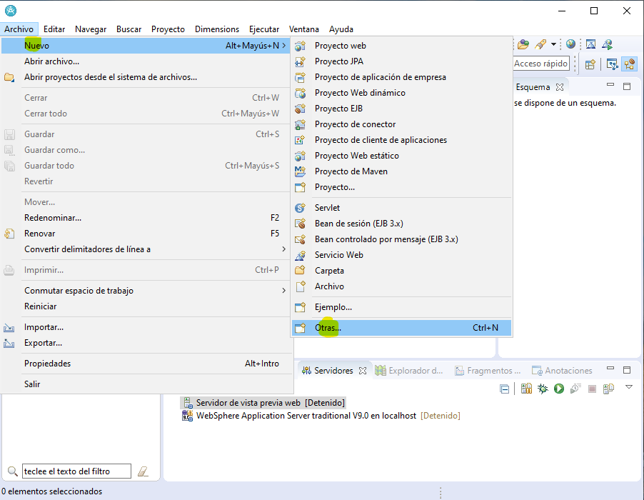
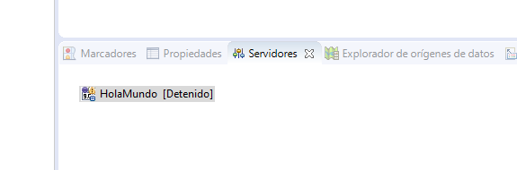

# Crear un servicio web SOAP con EJB en WebSphere 9

## Servicio web SOAP con EJB y WebSphere

En el este post, vamos a definir y desplegar un servicio web de Hola Mundo, que 
cuando le pasemos nuestro nombre, nos saludo.
El servidor que vamos a usar es *WebSphere Application Service* en adelante WAS9
con el RSA como IDE.

Que es un Servicio Soap, es un manera de comunicacion entre distintas aplicaciones 
que incluso pueden estar en diferentes lenguajes de programacion
porque siguen el mismo estandand.

Basicamente, se enviar un XML con informacion de entrada, y el servicio web la procesa y 
responde con otro XML. Para que el cliente que le invia la peticion, sepa el formato del XML 
permitido por el servidor, este publica un contrato llamado WSDL que define la estructura permitida 
del XML de entrada ... y asi el cliente puede comunicarse con el servicio.

Para realizar un proyecto de un servicio web en Java podemos
dividirlo principalmente en las siguientes tareas:
1. definimos un perfil en el servidor WAS9 donde se guarda la
configuracion del servidor.
2. Luego creamos un proyecto web que viene con la librería JAX-WS 
para definir un servicio.
3. Implementamos la funcion de saludar que contenga
la etiqueta @WebService para que sea un servicio web.
4. Accedemos el WSDL para
5. Crear un cliente con JUnit que compruebe el servicio

## Crear un Servicio

Abrimos el Rational Software Archtect, en adelante RSA
nos aparece una ventana para configurar el WAS. Para esta
practica vamos a usar WAS 9 y asi que no necesitamos WAS 8.5

En la siguiente pantalla desmarcamos e

Proyecto web dinamico

xxxxxx

## Ruta WSDL

### Buscar url del wsdl en el wsdl
http://localhost:9080/HolaMundo_WAR/x?wsdl

### Buscar url del wsdl en el wsdl

### Buscar url del wsdl en el rsa

## Consultar con el  RSA

## Consultar con el SoapUI

## Crear Cliente 

## Testear servicio